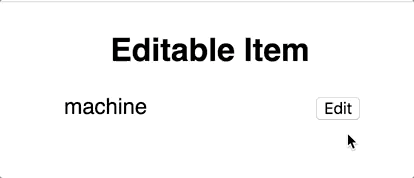

# Typed Machine
This library implements a **strict** model of an event-driven **Finite State Machine**. Its strictness is given by the Typescript type definitions, so it is best used in Typescript applications, to benefit from the type restrictions.

>__WARNING!__ This is the `dev` branch. Docs are outdated, will be updated once the API is more stable, and the branch will be merged in master.

<!-- MarkdownTOC levels="1,2,3,4" -->

- [Getting started](#getting-started)
- [Tutorial](#tutorial)
  - [The example - an Editable Item](#the-example---an-editable-item)
  - [Setup](#setup)
    - [States](#states)
    - [Transitions and Messages](#transitions-and-messages)
    - [Models](#models)
    - [Message Payloads](#message-payloads)
    - [Wrapping up - Defining the Template](#wrapping-up---defining-the-template)
  - [Defining the Machine](#defining-the-machine)
    - [Choosing a renderer](#choosing-a-renderer)
    - [The Machine Type](#the-machine-type)
    - [The transitions](#the-transitions)
    - [The view](#the-view)
    - [Putting it all together](#putting-it-all-together)
  - [Making it reusable](#making-it-reusable)
    - [Custom initial value](#custom-initial-value)
    - [Add an onChange Callback](#add-an-onchange-callback)
    - [Wrapping up - A reusable component](#wrapping-up---a-reusable-component)
- [API](#api)
  - [Types](#types)
    - [`DefineTemplate`](#definetemplate)
    - [`Machine`](#machine)
    - [`View`](#view)
    - [`Transitions`](#transitions)
  - [Containers](#containers)
    - [React](#react)
- [Adapters](#adapters)
  - [Developing a new adapter](#developing-a-new-adapter)
- [TODO](#todo)
- [Contributing](#contributing)
  - [New Adapters](#new-adapters)
  - [Other ideas](#other-ideas)
- [Acknowledgments](#acknowledgments)

<!-- /MarkdownTOC -->


## Getting started
```sh
npm i typed-machine
```

## Tutorial
This library uses concepts that are pretty abstract, so it's best to introduce them using a concrete example.

### The example - an Editable Item
Let's say we have the following use-case: we need an UI item that can be edited in-place. It should look like that:



This seems like a good candidate for a State Machine, so let's make one!

### Setup

#### States
At its core, a **Machine** is described by the set of **state**s the system can be in. In our case these are:
```ts
type EditableState = 'Readonly' | 'Editing';
```

#### Transitions and Messages
In order to make the machine interactive, we need to define transitions between the available states. And, since we want a **strict** machine, only certain transitions are legal from any given state.
In our case:
1. From _Readonly_, pressing "Edit" enables editing mode.
2. From _Editing_, pressing "Save" will update the item's value.
3. From _Editing_, pressing "Cancel" discards the changes.
4. There is also a less obvious one, in _Editing_ mode: when typing on the keyboard, the input value updates.

We'll need some way to trigger these transitions, and that is through **Messages**, which we'll talk about later on. For now, let's just define our messages: START_EDITING, SAVE, DISCARD, CHANGE_TEXT

#### Models
We'll need a place to store the value of the item, as well as the "draft" value while editing. The straightforward way of doing that is having a record holding these values:
```ts
type Data = {
  value: string;
  draft?: string;
}
```
But this approach can cause issues, because the `Data` can easily become out of sync with the current machine state: What does it mean for an _Editing_ item to have an undefined `draft`? Or for a _Readonly_ item to have a `draft` value?

But, since we have a State Machine, we can assign each state a certain piece of data, that we are sure it exists in the given state. We'll call that a **Model**. 

For our example, we'll have: 
```ts
type ReadonlyModel = { value: string };
type EditingModel = { draft: string };
```

It is certainly more clear what data each state can store. 

There is, however, an issue: how do we discard the change when _Editing_? The only data we have is the `draft`, and the original `value` is somewhere else, in the _Readonly_ model, that we can't reach, because we want to keep states decoupled.
But the solution is simple: just copy along the original value, when we transition from _Readonly_ to _Editing_.

One other minor improvement is that we can simplify the `ReadonlyModel` to a simple `string`, instead of a one-key record.
So the updated models would look like that:
```ts
type ReadonlyModel = string;
type EditingModel = { original: string; draft: string };
```

#### Message Payloads
One last thing we need to provide in order to fully specify our Machine's structure, is whether the **Messages** that trigger transitions also have some attached **payload**, something extra coming from the user. 

In our example, when updating the input, we need to know what's the new value, in order to update the `draft`. So the CHANGE_TEXT message will take an extra `string` as a payload.


#### Wrapping up - Defining the Template
Using all the setup bits from above, we can come up with an unified definition for what the Machine would look like (we'll call that a **Template**):
```ts
import { DefineTemplate } from 'typed-machine';

type EditableState = 'Readonly' | 'Editing';

type EditableTemplate = DefineTemplate<
  EditableState,
  {
    Readonly: {
      transitionPayloads: {
        START_EDITING: null;
      };
      model: string;
    };
    Editing: {
      transitionPayloads: {
        CHANGE_TEXT: string;
        SAVE: null;
        DISCARD: null;
      };
      model: { original: string; draft: string };
    };
  }
>;
```
We specify all the transitions implicitly through `transitionPayloads` (to avoid duplication), so we must give a payload type even to those which have no payload. By convention, that type is `null`;

### Defining the Machine
Now that we specified the structure of the Machine, we can go ahead and instantiate it.

#### Choosing a renderer
At its core, the library keeps the view layer abstract, and it uses **Adapters** to actually render something out. For this example we'll use the **React Adapter** (which is the only one at the moment).

#### The Machine Type
Since we're using the React Adapter, we'll use the `ReactMachine` type:
```ts
import { ReactMachine } from 'typed-machine/react';

type EditableMachine = ReactMachine<EditableState, EditableTemplate>;
```

#### The transitions
As we said before, transitions are how the Machine gets to a new States, and updates its model. 

In our case, we'll have something like:
```ts
import { Transitions } from 'typed-machine';

const readonlyTransitions: Transitions<EditableMachine, 'Readonly'> = {
  START_EDITING: value => ['Editing', { draft: value, original: value }]
}

const editingTransitions: Transitions<EditableMachine, 'Editing'> = {
  SAVE: ({ draft, original }) => ['Readonly', draft],
  DISCARD: ({ original }) => ['Readonly', original],
  CHANGE_TEXT: ({ original }, newDraft) => ['Editing', { original, draft: newDraft }],
}
```

So, transitions have the following pseudo-signature (not actual TS code, it's just illustrative):
```ts
{
  [m in MessageTypes]: (m: Model, p: Payload) => [SomeState, ModelForThatState]
}
```
Where the types are:
- `MessageTypes` - the available messages that can be dispatched from this State.
- `Model` - the model associated to the current state.
- `Payload` - the payload for the current transition - it is the type that was defined in `transitionPayloads` before. Of course, if there is no payload (i.e. it is `null`) it does not have to be specified in the function. This is the case for all the messages above, except `CHANGE_TEXT`, which taxes a `string` value.
- `SomeState` - one of the States of the Machine;
- `ModelForThatState` - the model associated with `SomeState`. This is one of the places where we can really see the benefits of defining a **Template**: Typescript is smart enough to correlate each State with its model, so we get type-safe transitions.

#### The view
Now that we've setup all the wiring, we need to actually show something to the user. For that, we'll use a `view` function for each State, which will display the model associated with that State, and also dispatch messages back to the Machine. Since we're using the React Adapter, each `view` must return a `JSX.Element`.

```ts
import { View } from 'typed-machine';

const readonlyView: View<EditableMachine, 'Readonly'> = (dispatch, model) => (
  <div>
    {model}
    <button onClick={() => dispatch('START_EDITING')}>Edit</button>
  </div>
)

const editingView: View<EditableMachine, 'Editing'> = (dispatch, { draft }) => {
  return (
    <div>
      <input
        type="text"
        value={draft}
        onChange={ev => { dispatch('CHANGE_TEXT', ev.target.value); }}
      />
      <button onClick={() => dispatch('SAVE')}>Save</button>
      <button onClick={() => dispatch('DISCARD')}>Cancel</button>
    </div>
  );
}
```

So, a `view` has the following pseudo-signature:
```ts
(
  dispatch: (mt: MessageType, mp?: MessagePayload) => void, 
  model: Model
) => JSX.Element
```
What is worth noting is that the each view function gets a different `dispatch`, depending on the State: each `dispatch` can only receive messages that are legal for that state. So, for example, `dispatch('START_EDITING')` in `editingView` would cause a compile error, because 

##### A note about the `dispatch` function, for Redux users.
> As the name suggests, this function is similar to the one in Redux. There are, however, a few differences:
> - The signature - Machine's dispatch takes the message (i.e. action) type and an optional payload, instead of a `{ type: string, ...payload }` action.
> - Scope - Machine's dispatch accepts only messages that are legal from the current state, whereas a Redux store can handle any message.

#### Putting it all together
We can view a machine as a Directed Graph, with **States** as nodes and **Transitions** as edges. Each state will be described by the information we introduced above:
- The **model**, with the type previously defined in the **Template**
- The **transitions** functions
- The **view** function

The last piece in the puzzle is the initial State of the Machine. And, with that, we can finally instantiate our `EditableMachine`:
```ts
const editableMachine: EditableMachine = {
  current: 'Readonly',
  graph: {
    Readonly: {
      model: 'Whatever',
      transitions: readonlyTransitions,
      view: readonlyView,
    },
    Editing: {
      model: { draft: '', original: '' },
      transitions: editingTransitions,
      view: editingView,
    },
  },
};
```

And, in order to integrate it in the React application, we wrap the machine instance in a `<Machine />`, provided by the React Adapter:
```ts
import { Machine } from 'typed-machine/react';

const EditableItem = () => (
  <Machine {...editableMachine} />
);
```

### Making it reusable
Now, we can use as many `<EditableItem />`s as we like in our app. Each will hold its internal state machine.  
But, as it is defined now, it's not that reusable. However, we can easily make some improvements.

#### Custom initial value
Instead of a hard-coded `editableMachine`, we can use a factory function:
```ts
const makeEditableMachine = (defaultValue: string): EditableMachine => ({
  current: 'Readonly',
  graph: {
    Readonly: {
      model: defaultValue,
      // ... same as before
    },
    Editing: {
      model: { draft: defaultValue, original: defaultValue },
      // ... same as before
    },
  },
})
```

#### Add an onChange Callback
To integrate our component in a bigger app, we might also need to notify the component's parent that the value has changed (when pressing "Save").
This feature is actually easy to add, with no special API: just use the callback in the appropriate **transition**:
```ts
function makeReadonlyTransitions(
  onChange: (t: string) => void,
): Transitions<EditableMachine, 'Editing'> {
  return {
    SAVE: ({ draft, original }) => {
      if (draft !== original) {
        onChange(draft);
      }
      return ['Readonly', draft];
    },
    // DISCARD: ... same as before
    // CHANGE_TEXT: ... same as before
  };
}
```

#### Wrapping up - A reusable component
```ts
export type EditableItemProps = {
  defaultValue: string;
  onChange: (s: string) => void;
};

const makeEditableMachine = ({ defaultValue, onChange }: EditableItemProps): EditableMachine => ({
  current: 'Readonly',
  graph: {
    Readonly: {
      model: defaultValue,
      transitions: readonlyTransitions,
      view: readonlyView,
    },
    Editing: {
      model: { draft: defaultValue, original: defaultValue },
      transitions: makeReadonlyTransitions(onChange),
      view: editingView,
    },
  },
});

export const EditableItem = (props: EditableItemProps) => (
  <Machine {...makeEditableMachine(props)} />
);
```

## API

### Types

#### `DefineTemplate`
This is a higher order type, that build the Template for the Machine. It takes the State, and a definition type that must have the following shape:
```ts
Record<string, {
  transitionPayloads: Record<string, any>;
  model: any;  
}>
```

Example:
```ts
import { DefineTemplate } from 'typed-machine';

type SimpleState = 'Default';

type SimpleTemplate = DefineTemplate<SimpleState, {
    Default: {
      transitionPayloads: {
        NOOP: null;
      };
      model: null;
    };
  }
>;
```
#### `Machine`
This type is at the core of the library. It's a higher order type, taking the View type, a State and a Template:
```ts
import { Machine } from 'typed-machine';

type SimpleMachine = Machine<JSX.Element, SimpleState, SimpleTemplate>;
```

However, type aliases provided by Adapters will be used instead:
```ts
import { ReactMachine } from 'typed-machine/react';

type SimpleMachine = ReactMachine<SimpleState, SimpleTemplate>;
```


#### `View`
This is an utility type, which allows extracting `view`s as separate functions:
```ts
import { View } from 'typed-machine';

const defaultView: View<SimpleMachine, 'Default'> = (dispatch) => (
  <button onClick={() => dispatch('NOOP')}>Doing nothing</button>
);
```

#### `Transitions`
Similar to `View`, it allows transitions to be defined separately:
```ts
import { Transitions } from 'typed-machine';

const defaultTransitions: Transitions<SimpleMachine, 'Default'> = {
  NOOP: () => ['Default', null],
};
```

### Containers

#### React
```ts
import { Machine } from 'typed-machine/react';

const simpleMachine: SimpleMachine = {
  current: 'Default',
  graph: {
    Default: {
      model: null,
      transitions: defaultTransitions,
      view: defaultView
    }
  }
}

export const SimpleMachine = () => (
  <Machine {...simpleMachine} />
);
```

## Adapters
In order to actually do anything useful with a **Machine**, we need an UI implementation, and also some a way to store the State Machine, and update its state once a transition is done. Both of these tasks are accomplished by an **Adapter**. Right now, only a React implementation is provided.

### Developing a new adapter
The core library exposes a simple function that allows a parent to 1) render the current State and 2) update external state when the Machine internal representation changes. That function has the following signature:

```ts
export function currentView<R, S extends string, GT extends GraphTemplate<S>>(
  machine: Machine<R, S, GT>,
  onChange: (updatedMachine: Machine<R, S, GT>) => void,
): R
```

Here, `R` is the return type for the `view` functions.

There are two things an adapter must expose:
1. A concrete `Machine` type (basically specifying the `view` return value - `R` from above). For example, the React Adapter exposes:
```ts
type ReactMachine<S extends string, GT extends GraphTemplate<S>> = Machine<JSX.Element, S, GT>
```

2. Some sort of "container" for the Machine. In the React Adapter, it's actually called just that: `Machine` and [its implementation](src/react/MachineAdapter.tsx) is really simple. The gist of it is the `render` function:
```ts
render() {
  return currentView(this.state, newMachine => {
    this.setState(newMachine);
  });
}
```

## TODO
There are still a lot of features to add, in order to make this library production ready:
- [ ] Investigate transition guards
- [ ] Handle side effects, like fetch requests.
- [ ] Nested Machines - find a good way to scale.
- [ ] Pluggable addons/middlewares (e.g. History with undo/redo support).
- [ ] _Nice to have_ Developer tooling (time travel debugging, etc.)
- [ ] _Nice to have_ React hook.
- [ ] _Nice to have_ Eslint plugin (e.g. identify unreachable States).

## Contributing

In case you're interested in this project, and you would like to contribute, there are some things to be done.

### New Adapters
Right now only the React adapter is provided, but it should be fairly easy to add new ones for other UI libraries such as Vue, Angular, etc. You can read the section about [developing a new adapter](#developing-a-new-adapter) and see [the React implementation](src/react/MachineAdapter.tsx) for reference.

### Other ideas
If you have other ideas or want to tackle one of the TODOs from above, let's start a discussion. Submit an issue with `[Idea]` of `[Feature]` "tag" and we'll start from there.

## Acknowledgments
This library borrows from a few sources:
- The main ideas (and some names) come from the [The Elm Architecture](https://guide.elm-lang.org/architecture/) and the [Elm language](https://elm-lang.org/) in general.
- Also, Redux was an inspiration (Redux is also [inspired by Elm](https://redux.js.org/introduction/priorart#elm), by the way).
- The [xstate](https://xstate.js.org/docs/) library served as a reference for implementing Finite State Machines in JavaScript.
